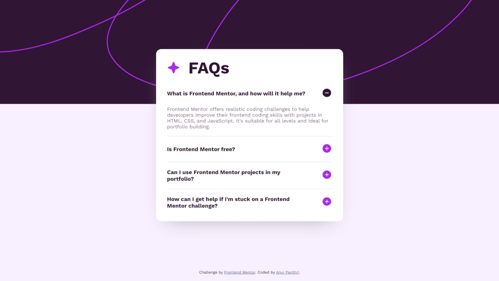
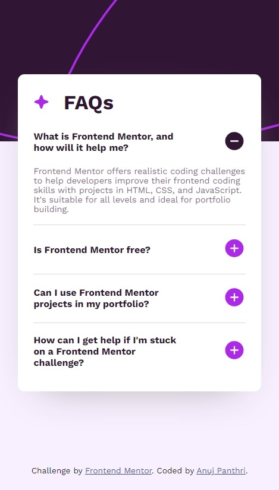

# Frontend Mentor - FAQ accordion solution

This is a solution to the [FAQ accordion challenge on Frontend Mentor](https://www.frontendmentor.io/challenges/faq-accordion-wyfFdeBwBz). Frontend Mentor challenges help you improve your coding skills by building realistic projects. 

## Table of contents

- [Overview](#overview)
  - [The challenge](#the-challenge)
  - [Screenshot](#screenshot)
  - [Links](#links)
- [My process](#my-process)
  - [Built with](#built-with)
  - [What I learned](#what-i-learned)
  - [Continued development](#continued-development)
- [Author](#author)

## Overview

### The challenge

Users should be able to:

- Hide/Show the answer to a question when the question is clicked
- Navigate the questions and hide/show answers using keyboard navigation alone
- View the optimal layout for the interface depending on their device's screen size
- See hover and focus states for all interactive elements on the page

### Screenshot




### Links

- Solution URL: [https://github.com/AnujPanthri/FAQ-Accordion-Challenge](https://github.com/AnujPanthri/FAQ-Accordion-Challenge)
- Live Site URL: [Add live site URL here](https://your-live-site-url.com)

## My process

### Built with

- Semantic HTML5 markup
- CSS custom properties
- Flexbox
- Mobile-first workflow
- JS

**Note: These are just examples. Delete this note and replace the list above with your own choices**

### What I learned

Well this challenge was kind difficult cuz i was unable to find an efficient way of making the accordion open/close logic

The main logic I used for collapsing/expanding :-


HTML Logic:-

```html
<div class="question">
  <button class="q_header">
    <span class="title">
      What is Frontend Mentor, and how will it help me?
    </span>
  </button>
  <div class="answer_container">
    <div class="text">
      Frontend Mentor offers realistic coding challenges to help developers improve their
      frontend coding skills with projects in HTML, CSS, and JavaScript. It's suitable for
      all levels and ideal for portfolio building.
    </div>
  </div>
</div>
```

CSS logic:-

```css

.question_container .question .answer_container {
    overflow: hidden;
    color: var(--GRAYISH-PURPLE);
    font-family: 'Work-Sans-Regular', sans-serif;
    font-size: 0.9em;
    font-weight: 400;
    transition: all 0.4s ease;

}

.question_container .question .answer_container>.text {
    padding-bottom: 1.3em;
}

.question_container .question:not(.open) .answer_container {
    height: 0 !important;
    padding: 0;
    margin: 0;

}
```

JS logic:-

```js
function set_answer_heights() {

    document.querySelectorAll(".faq_container .question").forEach(question => {
        var header = question.querySelector(".q_header");
        var answer_container = question.querySelector(".answer_container");
        header.onclick = function (event) {

            question.classList.toggle("open");
        };


        var height = answer_container.scrollHeight;
        console.log(height);
        answer_container.style.height = `${height}px`;

    });

}

window.addEventListener('load', ev => {
    set_answer_heights();
})
```

### Continued development

I feel there could be an better approach to handle the accordion animation.

## Author

- Website - [@AnujPanthri](https://www.github.com/AnujPanthri)
- Frontend Mentor - [@AnujPanthri](https://www.frontendmentor.io/profile/AnujPanthri)